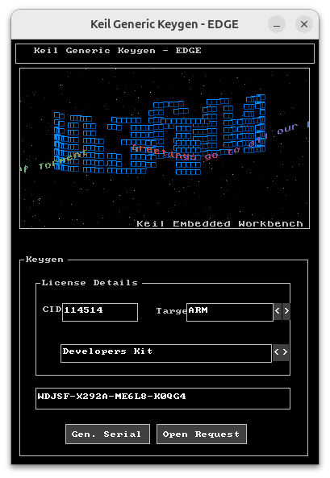
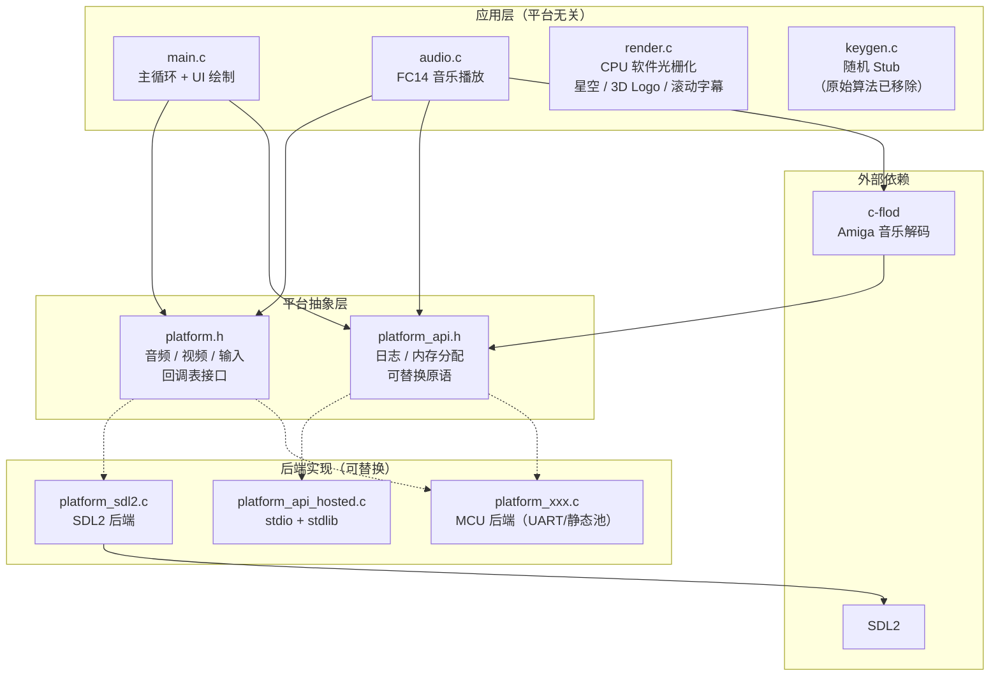
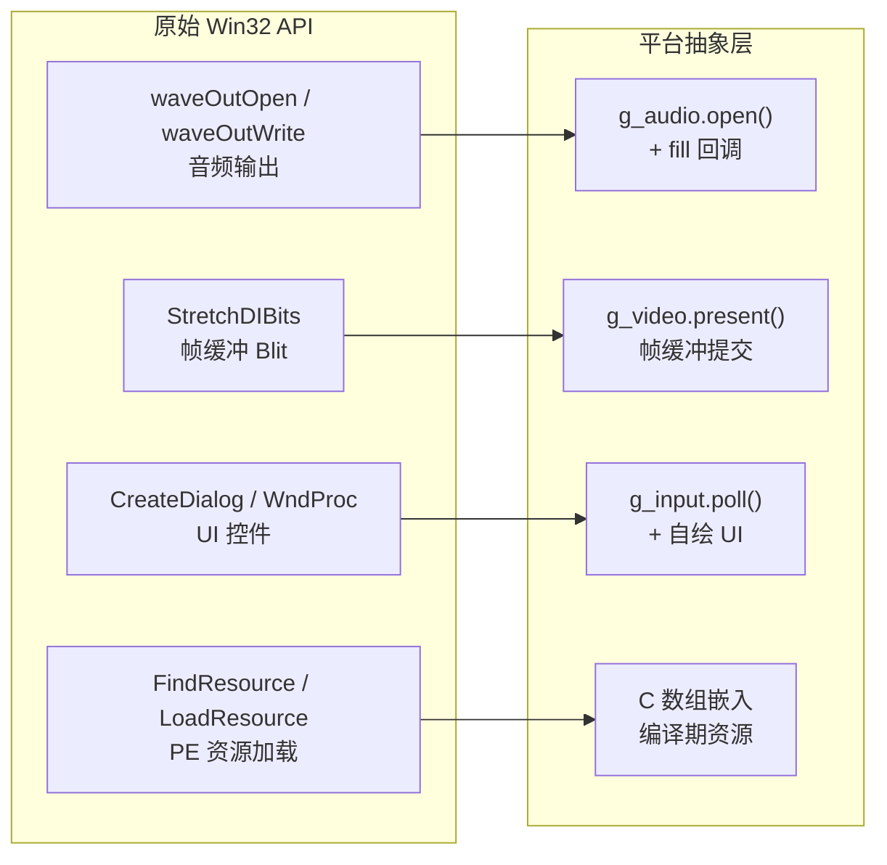

# Keygen_re

**Keil Keygen — 跨平台逆向工程移植 (GUI / 音频 / 渲染)**

> 如果你学过嵌入式，你大概率被这个注册机的魔性音乐和 3D 动画吓过一跳——然后再也忘不掉。
>
> 本项目将这个经典的 demoscene 程序从 Win32 移植到跨平台架构（默认 SDL2 后端），
> 保留了完整的 FC14 Amiga 音乐播放、CPU 软件光栅化渲染和复古风格 UI，
> **注册算法已移除**。核心逻辑与平台完全解耦，可移植到 MCU 等裸机环境。



## 这是什么

2008 年，EDGE Cracking Group 发布了一个 Keil 嵌入式开发工具的注册机
(`keygen_new2032.exe`)。抛开其用途不谈，这个程序本身是一个精致的 demoscene 作品：

- 🎵 **Amiga Future Composer 1.4** 格式的芯片音乐（作曲：Rhino of Torment）
- 🖼️ **纯 CPU 软件光栅化**：星空粒子系统、3D 旋转 Logo、正弦波滚动字幕
- 🪟 **Win32 原生 GUI**：对话框 + 控件，典型的 2000 年代 crackme 风格

本项目通过逆向工程分析原始 PE32 二进制文件，将上述三个子系统完整移植到
跨平台架构，作为一个 **Win32 → 可移植 C99 跨平台移植的技术案例**。

## 系统架构

项目采用分层设计，核心逻辑与平台完全解耦，可移植到 MCU 等裸机环境：



### 分层说明

| 层 | 文件 | 职责 | SDL 依赖 |
|----|------|------|----------|
| 应用层 | `main.c`, `audio.c`, `render.c`, `keygen.c` | 业务逻辑 | ❌ 无 |
| 平台接口 | `platform.h` | 音频/视频/输入回调表 | ❌ 无 |
| 平台原语 | `platform_api.h` | `platform_log` / `platform_malloc` / `platform_free` | ❌ 无 |
| SDL2 后端 | `platform_sdl2.c` | 唯一包含 `<SDL.h>` 的文件 | ✅ |
| 托管原语 | `platform_api_hosted.c` | stdio + stdlib 实现 | ❌ 无 |

### 原始 Win32 → SDL2 映射



### 目录结构

```
keygen_re/
├── src/
│   ├── main.c                  # 主循环、UI 绘制（平台无关）
│   ├── audio.c/h               # FC14 音乐播放（c-flod 封装）
│   ├── render.c/h              # CPU 软件光栅化引擎
│   ├── keygen.c/h              # 随机 Stub（原始算法已移除）
│   ├── platform.h              # 平台后端接口（音频/视频/输入回调表）
│   ├── platform_api.h          # 平台原语接口（日志/内存）
│   ├── platform_sdl2.c         # SDL2 后端实现
│   ├── platform_api_hosted.c   # 托管平台原语（stdio + stdlib）
│   ├── font8x8.h              # 8x8 像素位图字体
│   └── resources/             # 从 PE 提取的二进制资源
│       ├── resources.h        # FC14 音乐数据 + UI 常量
│       └── render_data.h      # 纹理 / 字体位图 / Logo 数据
├── c-flod/                    # Amiga 音乐格式解码库（git submodule）
├── cmake/
│   └── cflod_common_shim.h   # c-flod 兼容性 shim（不修改子模块）
├── docs/
│   ├── sdl-decouple-plan.md   # SDL 解耦设计文档
│   ├── reverse-engineering-report.md
│   └── image.png
├── scripts/
│   └── format.sh             # clang-format 自动格式化脚本
├── .clang-format              # WebKit 风格
├── .github/workflows/         # GitHub Actions CI
└── CMakeLists.txt
```

## 快速开始

### 环境要求

- Linux（Ubuntu 20.04+ 测试通过）
- CMake ≥ 3.16
- GCC 或 Clang
- SDL2 开发库
- Git（用于拉取子模块）

### 下载

```bash
git clone https://github.com/FASTSHIFT/keygen_re.git --recursive
cd keygen_re
```

如果已经 clone 但忘了 `--recursive`：

```bash
git submodule update --init --recursive
```

### 编译

```bash
# Ubuntu / Debian 安装依赖
sudo apt-get install cmake pkg-config libsdl2-dev

# 编译
cmake -B build
cmake --build build --parallel
```

### 运行

```bash
./build/keygen_re
```

启动后你会看到：
- 上半部分：星空粒子 + 3D 旋转 Logo + 正弦波滚动字幕
- 下半部分：复古风格 UI 控件
- 背景音乐：FC14 Amiga 芯片音乐自动播放

按 `ESC` 退出。

### 格式化代码

```bash
# 格式化所有源文件（WebKit 风格）
./scripts/format.sh

# CI 模式：只检查不修改，不合格返回非零
./scripts/format.sh --check
```

## FAQ

### Q: 这个能生成有效的 Keil 序列号吗？

**不能。** 原始的注册算法（CRC 校验、Base-35 编码、流密码变换等）已被完全移除，
替换为随机数生成器。点击按钮只会输出格式正确但完全无效的随机字符串。

### Q: 为什么要移植一个 2008 年的注册机？

技术价值。这个程序麻雀虽小五脏俱全：

- **FC14 播放器**是 Amiga 芯片音乐格式的完整实现，涉及 4 通道混音、自定义波形、包络处理
- **3D 渲染引擎**是纯 CPU 软件光栅化，没有任何 GPU API 依赖，包含透视投影、粒子系统、正弦波动画
- **整个程序只有一个 `.text` 节区**，代码和数据混合打包，是典型的 demoscene 紧凑风格

对于学习逆向工程、跨平台移植、复古图形编程的人来说，这是一个很好的实战案例。

### Q: 那个音乐是什么格式？

**Amiga Future Composer 1.4 (FC14)**，一种 1980-90 年代 Amiga 平台上的芯片音乐格式。
本项目使用 [c-flod](https://github.com/rofl0r/c-flod) 库进行解码播放。
音乐数据从原始 PE 文件的 `RT_RCDATA` 资源中提取，大小约 9.9 KB。

### Q: macOS / Windows 能编译吗？

可以。所有核心代码基于标准 C99，不依赖任何平台特定 API。SDL2 后端已在
macOS 14 (Apple Silicon) + AppleClang 17 上验证通过。Windows 需要
MSYS2/MinGW 或 vcpkg 配置 SDL2。

### Q: 能移植到 MCU / 嵌入式平台吗？

可以。项目架构专门为此设计：

1. 实现 `platform_log` / `platform_malloc` / `platform_free`（重定向到 UART、RTT、静态内存池等）
2. 实现 `platform.h` 中的音频/视频/输入回调表（对接 I2S DAC、LCD 驱动、按键扫描等）
3. 链接你的实现替代 `platform_sdl2.c` + `platform_api_hosted.c`

核心代码（`main.c`、`audio.c`、`render.c`）无需任何修改。

### Q: 逆向工程报告里有什么？

`docs/reverse-engineering-report.md` 包含：
- PE 文件结构分析（节区布局、资源表、入口点）
- 程序架构（线程模型、函数地址映射）
- FC14 音乐播放器的完整分析（模块结构、通道处理、效果命令）
- 3D 渲染引擎分析（帧缓冲、星空粒子、滚动字幕）
- Win32 → SDL2 移植方案

注册算法相关的分析内容已移除。

## 许可证

本项目代码采用 [MIT License](LICENSE)。

第三方组件：
- **c-flod**：见 [c-flod/license.txt](c-flod/license.txt)
- **原始音乐/美术资源**：来自 EDGE Cracking Group 的 demoscene 作品，版权归原作者所有

## 免责声明

⚠️ **本项目仅供技术学习与交流使用。**

- 本项目 **不包含** 任何有效的注册码生成算法，所有 keygen 相关函数均为随机数 stub
- 本项目的目的是展示逆向工程分析、跨平台移植和 demoscene 渲染技术，**不鼓励、不支持任何形式的软件破解行为**
- 使用者应遵守所在地区的法律法规，因使用本项目产生的任何法律问题，由使用者自行承担
- 如果本项目侵犯了您的权益，请通过 Issue 联系，我们会及时处理
