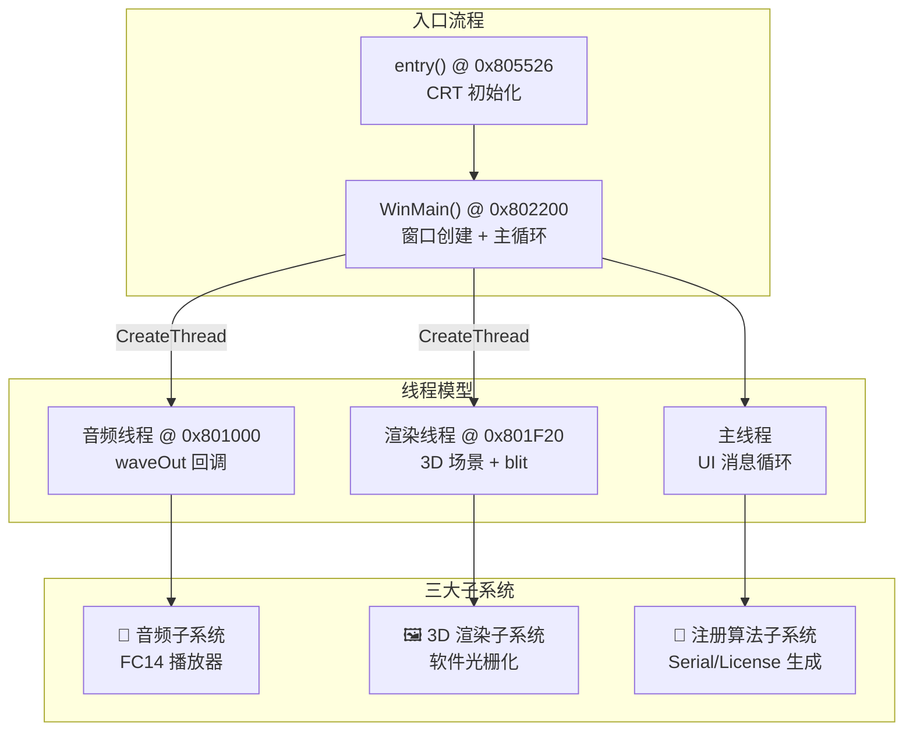
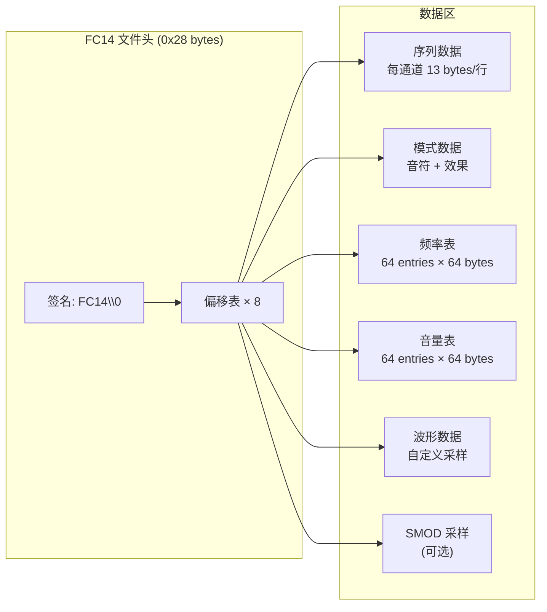
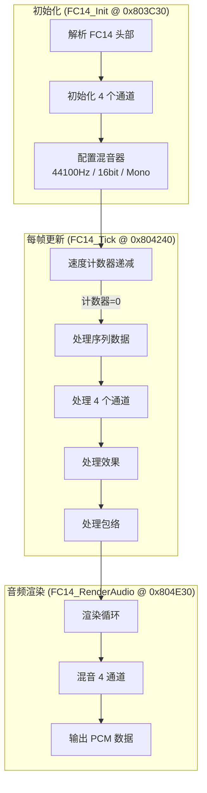
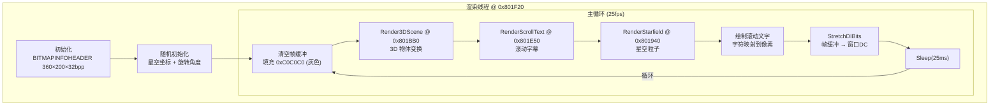
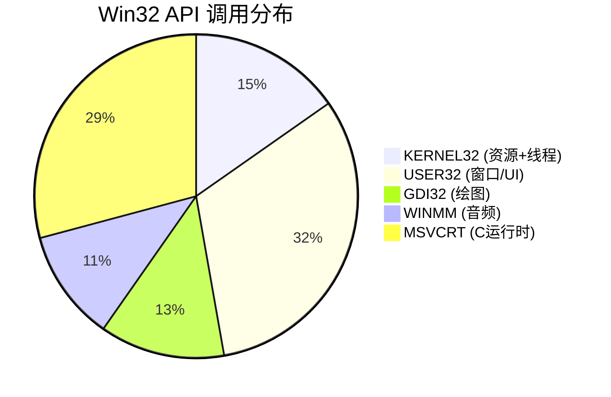
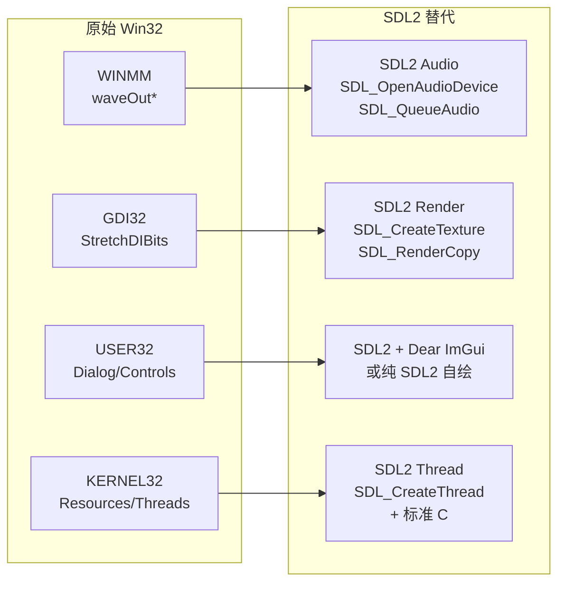

# Keil Keygen (keygen_new2032.exe) 逆向工程报告

> **作者**: EDGE Cracking Group
> **编译时间**: 2008-02-27 17:42:26 UTC
> **文件大小**: 509,575 bytes (497 KB)
> **格式**: PE32 (GUI) Intel 80386, for MS Windows
> **音乐**: Rhino of Torment

## 1. PE 文件结构总览

| 字段 | 值 | 说明 |
|------|-----|------|
| ImageBase | `0x00800000` | 加载基址 |
| EntryPoint | `0x00805526` | CRT入口 |
| WinMain | `0x00802200` | 真正主函数 |
| Sections | 1 (`.text`) | 代码+数据合并 |
| Subsystem | GUI (2) | Windows图形界面 |
| DLL特征 | `0x0` | 无ASLR/DEP/NX |

### 节区布局

| 节名 | 虚拟地址 | 虚拟大小 | 原始大小 | 属性 |
|------|---------|---------|---------|------|
| `.text` | `0x1000` | `0x80C19` | `0x7B687` | 可读/可写/可执行 |

> 只有一个节区，代码和数据混合在一起，典型的 demoscene 风格紧凑打包。

### 资源表

| 类型 | 名称/ID | 大小 | 用途 |
|------|---------|------|------|
| RT_BITMAP | ID_110 | 200B | 小图标位图 |
| RT_BITMAP | ID_111 | 2,510B | "Gen. Serial" 按钮图 |
| RT_BITMAP | ID_112 | 1,922B | "Open Request" 按钮图 |
| RT_ICON | ID_1 | 744B | 32x32 图标 |
| RT_ICON | ID_2 | 296B | 16x16 图标 |
| RT_DIALOG | KEYGEN | 556B | 主对话框模板 |
| **RT_RCDATA** | **TUNE** | **9,902B** | **FC14 音乐模块** |
| RT_GROUP_ICON | ID_105/107 | 20B | 图标组 |

## 2. 程序架构



### 函数地址映射表

| 地址 | 函数名(推断) | 子系统 | 功能 |
|------|-------------|--------|------|
| `0x801000` | `AudioThreadProc` | 音频 | 音频线程入口，处理 waveOut 消息 |
| `0x8010B0` | `AudioBufferInit` | 音频 | 分配音频缓冲区 (16个 × 1KB) |
| `0x801210` | `AudioDeviceOpen` | 音频 | 打开 waveOut 设备，44100Hz/16bit/Mono |
| `0x8013C0` | `MusicLoad` | 音频 | 加载 TUNE 资源，初始化 FC14 播放器 |
| `0x801830` | `DrawPixelBlock` | 渲染 | 绘制像素块到帧缓冲 |
| `0x801940` | `RenderStarfield` | 渲染 | 渲染星空/粒子背景 |
| `0x801BB0` | `Render3DScene` | 渲染 | 3D 场景变换与渲染 |
| `0x801E50` | `RenderScrollText` | 渲染 | 渲染滚动字幕 |
| `0x801F20` | `RenderThreadProc` | 渲染 | 渲染线程主循环 |
| `0x802200` | `WinMain` | UI | 窗口创建、消息循环 |
| `0x802520` | `WndProc` | UI | 窗口过程，处理按钮点击等 |
| `0x802900` | `GenerateSerial` | 注册 | 生成 Serial Number |
| `0x802DE0` | `EncodeChar` | 注册 | 字符编码 (base-35) |
| `0x802E00` | `ComputeCRC` | 注册 | CRC 校验计算 |
| `0x802ED0` | `ComputeChecksum` | 注册 | 校验和计算 |
| `0x8030D0` | `GenerateLicenseKey` | 注册 | 生成 License Key (LIC) |
| `0x8039E0` | `DecodeChar` | 注册 | 字符解码 (base-35) |
| `0x803A00` | `TransformChar` | 注册 | 字符变换 (加密步骤) |
| `0x803A70` | `MT19937_Seed` | 注册 | Mersenne Twister 种子初始化 |
| `0x803AD0` | `MT19937_Rand` | 注册 | Mersenne Twister 随机数生成 |
| `0x803C30` | `FC14_Init` | 音频 | Future Composer 1.4 模块解析 |
| `0x804240` | `FC14_Tick` | 音频 | FC14 每帧更新 (节拍处理) |
| `0x804340` | `FC14_ProcessChannel` | 音频 | FC14 通道处理 |
| `0x804530` | `FC14_ProcessEffects` | 音频 | FC14 效果处理 |
| `0x804930` | `FC14_ProcessEnvelope` | 音频 | FC14 包络处理 |
| `0x804BA0` | `FC14_SetSample` | 音频 | FC14 设置采样参数 |
| `0x804C00` | `FC14_SetFrequency` | 音频 | FC14 设置频率 |
| `0x804C70` | `FC14_SetupMixer` | 音频 | FC14 混音器初始化 |
| `0x804E30` | `FC14_RenderAudio` | 音频 | FC14 音频渲染 (PCM 输出) |
| `0x804F60` | `FC14_MixMono8` | 音频 | FC14 单声道8bit混音 |

## 3. MIDI/音频合成器分析 (Future Composer 1.4)

### 3.1 格式识别

TUNE 资源的前4字节为 `FC14` (0x46433134)，这是 **Amiga Future Composer 1.4** 格式。

> Future Composer 是 1980-90 年代 Amiga 平台上流行的音乐编辑器，由 SuperSero 编写。
> FC14 是其最终版本，支持 4 个声道、自定义波形和丰富的效果。

### 3.2 FC14 模块结构



### 3.3 播放器架构



### 3.4 通道结构 (每通道 0xA0 bytes)

| 偏移 | 大小 | 字段 | 说明 |
|------|------|------|------|
| +0x00 | 4 | samplePtr | 当前采样指针 |
| +0x04 | 2 | sampleLen | 采样长度 |
| +0x08 | 4 | seqPtr | 序列数据指针 |
| +0x0C | 4 | seqEnd | 序列结束地址 |
| +0x10 | 2 | seqOffset | 序列偏移 |
| +0x14 | 4 | patPtr | 模式数据指针 |
| +0x18 | 2 | patOffset | 模式偏移 |
| +0x1A | 1 | transpose | 转调值 |
| +0x1C | 1 | note | 当前音符 |
| +0x1D | 1 | noteRaw | 原始音符值 |
| +0x21 | 1 | vibrato | 颤音深度 |
| +0x24 | 2 | portamento | 滑音值 |
| +0x28 | 4 | freqTablePtr | 频率表指针 |
| +0x2C | 2 | freqTableOff | 频率表偏移 |
| +0x31 | 1 | volEnvSpeed | 音量包络速度 |
| +0x32 | 1 | volEnvCounter | 音量包络计数器 |
| +0x34 | 4 | volTablePtr | 音量表指针 |
| +0x38 | 2 | volTableOff | 音量表偏移 |
| +0x3B | 1 | volSlideDir | 音量滑动方向 |
| +0x3D | 1 | volSlideSpeed | 音量滑动速度 |
| +0x3E | 1 | volTarget | 目标音量 |
| +0x3F | 1 | volCurrent | 当前音量 |
| +0x41 | 1 | volActual | 实际输出音量 |
| +0x42 | 2 | period | 输出周期值 |

### 3.5 效果命令

| 命令字节 | 名称 | 说明 |
|----------|------|------|
| `0xE0` | Jump | 跳转到指定偏移 |
| `0xE1` | End | 模式结束 |
| `0xE2` | SetSample | 设置采样 (从采样表) |
| `0xE3` | SetModulation | 设置调制参数 |
| `0xE4` | SetVolTable | 设置音量表 |
| `0xE7` | SetFreqTable | 设置频率表 |
| `0xE8` | Wait | 等待 N 帧 |
| `0xE9` | SetSampleSSMP | 设置 SSMP 采样 |
| `0xEA` | VolumeSlide | 音量滑动 |

### 3.6 混音器

- **采样率**: 44,100 Hz
- **位深**: 16-bit (内部) → 8-bit (输出到 waveOut)
- **声道**: 单声道 (Mono)
- **通道数**: 4 (Amiga 风格)
- **混音方式**: 线性叠加，查表法音量缩放
- **缓冲区**: 16 个 × 1024 bytes，双缓冲轮转

## 4. 3D 动画渲染分析

### 4.1 渲染架构



### 4.2 帧缓冲

| 参数 | 值 | 说明 |
|------|-----|------|
| 宽度 | 360 px (`0x168`) | |
| 高度 | 200 px (`0xC8`) | 负值表示 top-down |
| 色深 | 32 bpp | BGRA 格式 |
| 缓冲区地址 | `0x82F4F8` | 前景缓冲 |
| 后备缓冲 | `0x875458` | 用于双缓冲 |
| 帧缓冲大小 | 360 × 200 × 4 = 288,000 bytes | |

### 4.3 3D 场景

- **渲染方式**: 纯 CPU 软件光栅化，无 OpenGL/DirectX
- **物体**: 旋转的 3D 几何体 (可能是 torus 或类似形状)
- **星空**: ~2800 个粒子 (`0x5780/8 = 2816`)，随机分布
- **滚动字幕**: 从右向左滚动的 demoscene 风格文字
- **颜色**: 灰色背景 (`0xC0C0C0`)，字符使用调色板映射
- **帧率**: ~40 FPS (Sleep 25ms)

### 4.4 滚动字幕内容

```
WELCOME TO ANOTHER NICE KEYGEN FROM YOUR FRIENDS AT EDGE...
Today we bring you "Keil Embedded Workbench"
Protection: Custom
ALWAYS REMEMBER: WE ARE DEDICATED TO QUALITY, NOT QUANTITY,
AND ALWAYS DOING IT FOR THE LULZ!
Nice music composed by Rhino of Torment
Greetings go to all our friends and contacts from all the years...
```

## 5. 注册算法分析

> **NOTICE**: 注册算法的详细分析已从本报告中移除。本项目仅用于技术交流，
> 聚焦于 demoscene 渲染技术、Amiga FC14 音乐播放和 Win32→SDL2 跨平台移植。

## 6. Linux 移植可行性分析

### 6.1 Win32 API 依赖统计



### 6.2 各子系统移植难度

| 子系统 | API 数量 | 移植难度 | 替代方案 | 说明 |
|--------|---------|---------|---------|------|
| 🎵 FC14 播放器 | 0 | ⭐ 零 | 直接复制 | 纯算法，平台无关 |
| 🎵 音频输出 | 8 | ⭐⭐ 低 | SDL2 Audio | waveOut → SDL_Audio |
| 🖼️ 3D 渲染 | 1 | ⭐⭐ 低 | SDL2 Texture | 软渲染，仅 StretchDIBits |
| 🪟 UI 控件 | 23 | ⭐⭐⭐ 中 | SDL2 + ImGui | ComboBox/Button/Edit |
| 📚 C 运行时 | 21 | ⭐ 零 | glibc | 标准 C 函数 |

### 6.3 推荐移植方案: SDL2



### 6.4 关键移植点

#### 6.4.1 音频 (最简单)

```
原始流程:
  waveOutOpen(44100Hz, 16bit, Mono)
  → 音频线程循环:
    PostThreadMessage(WOM_DONE) 触发
    → FC14_RenderAudio() 填充缓冲
    → waveOutWrite() 提交

SDL2 替代:
  SDL_OpenAudioDevice(44100Hz, 16bit, Mono, callback)
  → 回调函数中直接调用 FC14_RenderAudio()
  → SDL 自动管理缓冲和播放
```

音频线程模型从 "推送式" (waveOutWrite) 变为 "拉取式" (SDL callback)，反而更简单。

#### 6.4.2 3D 渲染 (简单)

```
原始流程:
  CPU 软渲染 → 内存缓冲区 (360×200×32bpp)
  → StretchDIBits() blit 到窗口 DC

SDL2 替代:
  CPU 软渲染 → 同一个内存缓冲区
  → SDL_UpdateTexture() 上传像素
  → SDL_RenderCopy() 显示
```

渲染核心完全不需要改，只替换最后的 blit 调用。

#### 6.4.3 UI (需要重写)

原始 UI 使用 Win32 Dialog + 控件:
- 2 个 ComboBox (Target / License)
- 2 个 Button (Gen Serial / Open Request)
- 文本输入框 (CID)
- 文本输出框 (Serial / License Key)

推荐方案:
1. **Dear ImGui** (最快): 几十行代码搞定所有控件
2. **纯 SDL2 自绘**: 更贴近原始外观，但工作量大
3. **GTK/Qt**: 杀鸡用牛刀，不推荐

#### 6.4.4 资源提取

PE 资源 (位图、图标、TUNE) 需要在编译时提取为独立文件，或嵌入到 C 数组中:

```c
// 从 PE 提取的 FC14 音乐数据
static const uint8_t tune_data[] = { /* 9902 bytes */ };
// 从 PE 提取的位图
static const uint8_t btn_gen_bmp[] = { /* 2510 bytes */ };
```

### 6.5 结论

**完全可行，且工作量不大。** 核心原因:

1. **3D 渲染是纯 CPU 软渲染** — 没有 DirectX/OpenGL 依赖，只需替换最终的 blit 调用
2. **FC14 播放器是纯算法** — 零平台依赖，直接复制
3. **音频只用了 waveOut** — SDL2 Audio 一对一替换
4. **UI 控件很少** — 2 个下拉框 + 2 个按钮 + 文本框，ImGui 几十行搞定

唯一需要"重写"的部分是 UI 层，但控件数量极少。整个程序的核心逻辑（音乐播放、3D 渲染）都是平台无关的纯计算代码。
